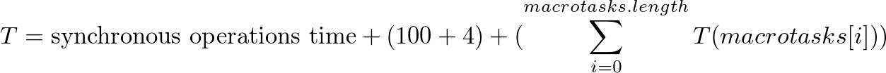
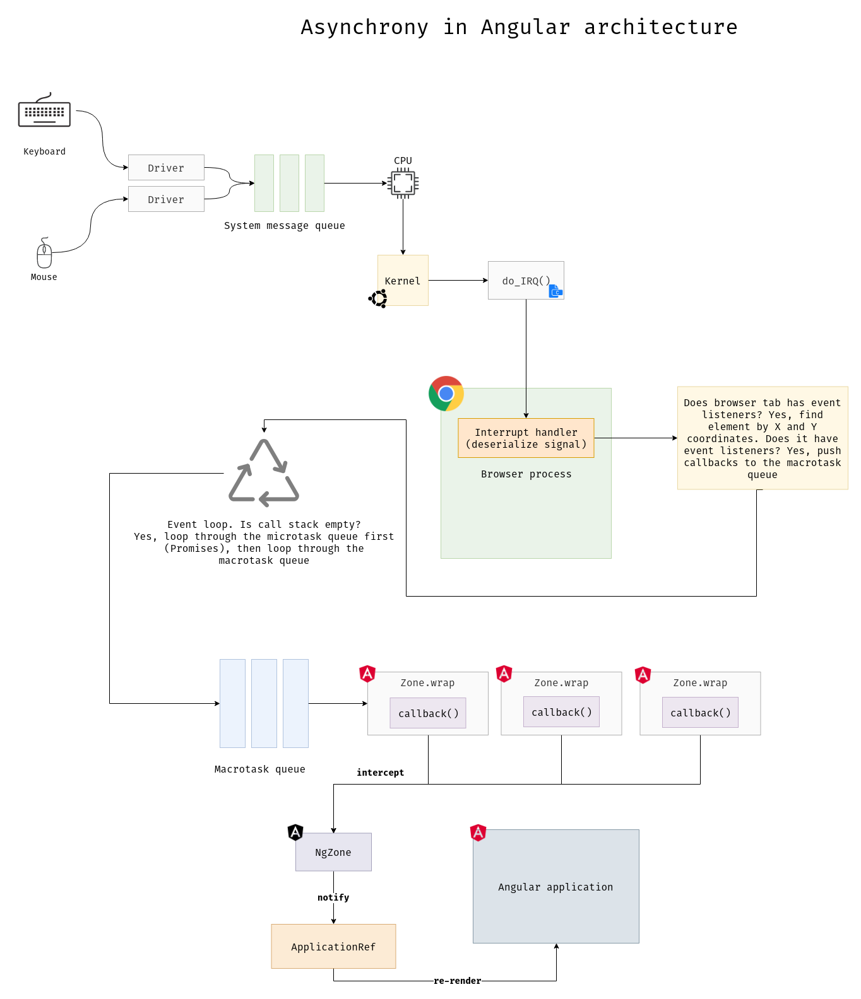

# Performance Boosting and Optimization of Angular Applications Cookbook

## Theoretical Introduction

Good performance is an incredible feature of any UIX, performance always requires optimizations. Large-scale production applications with high data throughput are very sensitive to performance.

**KYT** - know your tool. This can be really useful in deciding how or what to optimize.

Poor performance is always a disadvantage of any very large enterprise application. Angular is very painful to unmanaged change detection. To understand how change detection works under the hood - we have to understand how Angular has total control over browser's event loop. This magic is brought by zone.js library. Just to understand how many times your application is re-rendered - you can do such simple thing:

```typescript
import { ApplicationRef } from '@angular/core';
 
const tick = ApplicationRef.prototype.tick;
ApplicationRef.prototype.tick = function() {
  console.log(`I'm re-rendering the whole app...`);
  return tick.call(this);
};
```

You can also subscribe to the `NgZone.onStable` but more on that later. Zone allows you to control the life cycle of asynchronous tasks in the browser.

### Event Loop

The below theory will help you to understand how browser's event loop works.

Let's look at this simple example:

```typescript
setTimeout(() => {
  console.log('setTimeout.callback is invoked');
}, 100);
```

Will the callback, passed into `setTimeout`, invoked immediately? No, it will be invoked in:

<!--
T = \textup{synchronous} \textup{ operations} \textup{ time} + (100 + 4) + (\sum_{i = 0}^{macrotasks.length} T(macrotasks[i]))
-->



How does this formula work? Paste this code into your browser's console:

```typescript
const t0 = performance.now();
for (let i = 0; i < 1e9; i++) {}
const t1 = performance.now();
console.log(`"for" loop took ${t1 - t0}ms`);
 
setTimeout(() => {
  const t0setTimeout = performance.now();
  for (let i = 0; i < 1e9; i++) {}
  const t1setTimeout = performance.now();
  console.log(`"for" loop inside "setTimeout" took ${t1setTimeout - t0setTimeout}ms`);
});
 
setTimeout(() => {
  console.log('second "setTimeout" callback');
});
```

This means that `setTimeout` depends on the execution time of all synchronous operations, as well as on the execution time of previously scheduled macro tasks.

The event loop is a mechanism that schedules asynchronous tasks and performs them at the right time. You can also call it as an asynchronous task orchestrator. By itself, the event loop is single-threaded. Under the hood, it just uses the ready-made tools supplied with the operating system. For example **timer_create** (for `setTimeout`) on the POSIX-compliant systems (Ubuntu, Mac OS X, etc.).



### zone.js

The zone is a super peasant who allows you to track the life cycle of asynchronous tasks from any part of the application. Assume you're using some external library that schedules and executes micro-tasks (`Promise`) under the hood. You want to do something before the callback inside `Promise.then(...)` is invoked:

```typescript
import 'zone.js';
import * as library from 'external-library';
 
const zone = Zone.current.fork({
  name: 'myAwesomeZone',
  onInvokeTask: (delegate, current, target, task, applyThis, applyArgs) => {
    console.log('Preparing to run some "then" callback...');
    return delegate.invokeTask(target, task, applyThis, applyArgs);
  },
  onInvoke: (delegate, current, target, callback, applyThis, applyArgs, source) => {
    console.log('Callback will be run: ', callback);
    console.log(`Let's do something before the callback is invoked...`);
    // Note this function below!
    doMyAmazingStuffHere();
    return delegate.invoke(target, callback, applyThis, applyArgs, source);
  }
});
 
zone.run(() => {
  library.someAwesomeFunction();
});
```

`zone.js` patches most of asyncrhonous browser's API, it includes:

  * `setTimeout`
  * `setInterval`
  * `Promise`
  * `requestAnimationFrame`
  * `XMLHttpRequest`
  * `addEventListener`

How does it look like?

```typescript
// Save the original reference to setTimeout
const originalSetTimeout = window.setTimeout;
// Overwrite the API with a function which wraps callback in zone
window.setTimeout = function(callback, delay) {
  // Invoke the original API but wrap the callback in zone
  return originalSetTimeout(
    // Wrap the callback method
    Zone.current.wrap(callback),
    delay
  );
};
```

Angular uses the same mechanism, it creates its own zone, called `angular`, and also provides a singleton facade - the `NgZone` class. You do not have direct access to the zone API, but only through the public methods of the `NgZone` class. The `angular` zone allows Angular to control asynchronous operations and re-render the application when performing any asynchronous operation.

That's why you don't care about view updates, let's look here:

```typescript
import { Component } from '@angular/core';

@Component({
  selector: 'app-todos',
  template: `
    <app-todo *ngFor="let todo of todos" [todo]="todo"></app-todo>
  `
})
export class TodosComponent {
  todos: Todo[] = [];

  constructor(todoService: TodoService) {
    todoService.getTodos().subscribe(todos => {
      this.todos = todos;
    });
  }
}
```

`HttpClient` uses `XMLHttpRequest` under the hood and just wraps it into `Observable`. Angular is notified that the `XMLHttpRequest.prototype.onload` callback is invoked and the whole application needs to be re-rendered. Eazy right? 😹

### Change Detection

After exploring the zones, we can now become familiar with the change detection. Change detection is the process of synchronizing a model with a view. The data flow is unidirectional, even when `ngModel` is used to implement two-way binding, which is syntactic sugar over the unidirectional flow.

Change detection mechanism moves only forward and never looks back, starting from the top (root) component to the last. This is the meaning of one-way data flow. The architecture of the Angular application is very simple - the component tree. Each component points to the child, but the child does not indicate the parent. One-way flow eliminates the need for a `$digest` loop (like in AngularJS).

Change detection can be caused by Angular itself or manually. When some asynchronous task is performed in the Angular zone - Angular invokes `ApplicationRef.tick` which simply loops over views and calls `detectChanges`.

#### OnPush Change Detection Strategy

OnPush is a restriction on when the next change detection should be run on a component that is marked as `OnPush`. Eazy? 👽

As you remember there are 3 kind of asynchronous tasks in the browser:

* Microtask. A microtask is a work which will be executed as soon as possible on empty stack frame (`Promise.then` executes microtask).
* Macrotask. Macrotasks are interleaved with rendering and I/O operations of the host environment (`setTimeout`, `setInterval`, etc.). Macrotasks are guaranteed to run at least once or canceled.
* Event task. Event tasks are similar to macro tasks, but unlike macro tasks they may never run (`click`, `mousemove`, etc.).

There are different kinds of event tasks but DOM events are the part of them. So how `OnPush` works? Let's look at the below example:

```typescript
import { Component, ChangeDetectionStrategy } from '@angular/core';

@Component({
  selector: 'app-todos',
  template: `
    <button (click)="loadTodos()">Load todos</button>
    <app-todo *ngFor="let todo of todos" [todo]="todo"></app-todo>
  `,
  changeDetection: ChangeDetectionStrategy.OnPush
})
export class TodosComponent {
  todos: Todo[] = [];

  constructor(private todoService: TodoService) {}

  loadTodos(): void {
    this.todoService.getTodos().subscribe(todos => {
      this.todos = todos;
    });
  }
}
```

This will not work and we won't see our todos. Why? Because Angular will not run change detection on a component, marked as `OnPush`, when some macrotask is performed (`XMLHttpRequest.onload` is a macrotask). BUT, Angular will run change detection on a component if:

* Reference to any `@Input` binding has changed
* Some DOM event occured
* An `Observable` or `Promise` piped with async has generated value
* We manually detect changes
* Why DOM events? Angular patches dispatchEvent under the hood and calls `ChangeDetectorRef.markForCheck()`.

What about `async` pipe? `async` pipe subscribes to the input observable and calls `ChangeDetectorRef.markForCheck()` in the subscribe callback.

How to make the above example work?

```typescript
import { Component, ChangeDetectionStrategy, ChangeDetectorRef } from '@angular/core';

import { finalize } from 'rxjs/operators';

@Component({
  selector: 'app-todos',
  template: `
    <button (click)="loadTodos()">Load todos</button>
    <app-todo *ngFor="let todo of todos" [todo]="todo"></app-todo>
  `,
  changeDetection: ChangeDetectionStrategy.OnPush
})
export class TodosComponent {
  todos: Todo[] = [];

  constructor(private ref: ChangeDetectorRef, private todoService: TodoService) {}

  loadTodos(): void {
    this.todoService
      .getTodos()
      .pipe(finalize(() => this.ref.detectChanges()))
      .subscribe(todos => {
        this.todos = todos;
      });
  }
}
```

`finalize` is an operator that will invoke callback when the stream completes or errors. In our case we set `this.todos`, then `getTodos()` stream completes, `finalize` is notified and invokes callback, callback invokes `detectChanges()`. Profit 🤑

But, the problem is that the view can be destroyed before the response comes, but we can create our custom operator that will check if the view is not destroyed:

```typescript
export function detectChanges<T>(ref: ChangeDetectorRef) {
  return finalize<T>(() => {
    // `ChangeDetectorRef` is a reference to the `ViewRef` class
    const destroyed = (ref as ViewRef).destroyed;
    if (!destroyed) {
      ref.detectChanges();
    }
  });
}
```

And use it like:

```typescript
this.todosService
  .getTodos()
  .pipe(detectChanges(this.ref))
  .subscribe(todos => {
    this.todos = todos;
  });
```
