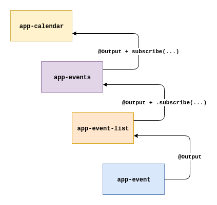

# Managing Events

## EventEmitter Abuse

Imagine a reusable `app-button` component, there is no problem if we use it 5 or 6 times, what about 50 or 100 times? The `app-button` component looks like this:

```typescript
import { Component, ChangeDetectionStrategy, Input, Output, EventEmitter } from '@angular/core';
 
@Component({
  selector: 'app-button',
  templateUrl: './button.component.html',
  styleUrls: ['./button.component.scss'],
  changeDetection: ChangeDetectionStrategy.OnPush
})
export class ButtonComponent {
  @Input() color: string = null;

  @Input() shouldEmit = false;

  @Output() click = new EventEmitter<void>();

  onClick(): void {
    if (this.shouldEmit) { // This is just a rough example
      this.click.emit();
    }
  }
}
```

Imagine we render a list of 100 items and every item has an `app-button` like:

```html
<div *ngFor="let item of items">
  <app-button color="blue" [shouldEmit]="true" (click)="doSomeStuff()"></app-button>
</div>
```

Do you know how much memory is gonna be allocated? Let's calculate:

* `Observable` - 96 bytes
* `Subject` - 96 bytes
* `EventEmitter` - 104 bytes
* `Subscription` - 104 bytes
* `Event`  - 56 bytes
* `MouseEvent` - 40 bytes

Because `EventEmitter extends Subject` and `Subject extends Observable`. `Subscription` is also allocated because Angular subscribes to the `EventEmitter` under the hood. So we've got:

```console
96 + 96 + 104 + 104 + 56 + 40 = 496 * 100 = 49600 bytes
```

49600 bytes for some dummy 100 buttons that emit events really? I'm not religious, but it becomes more complicated for the browser to manage memory when you've got some really large application, thousands of components rendered simultaneously.

Angular supports native event dispatching:

```typescript
import { Component, ChangeDetectionStrategy, Input, ElementRef } from '@angular/core';

@Component({
  selector: 'app-button',
  templateUrl: './button.component.html',
  styleUrls: ['./button.component.scss'],
  changeDetection: ChangeDetectionStrategy.OnPush
})
export class ButtonComponent {
  @Input() color: string = null;

  @Input() shouldEmit = false;

  constructor(private host: ElementRef<HTMLElement>) {}

  click(): void {
    if (this.shouldEmit) {
      this.host.nativeElement.dispatchEvent(new CustomEvent('click'));
    }
  }
}
```

Those events can also `bubble`. If you've got such tree:

```
— app-calendar
  — app-events
    — app-event-list
      — app-event
```

You can dispatch events from the `app-event` component and the `app-calendar` component can capture those events:

```TS
const event = new CustomEvent('chooseEvent', {
  detail: this.event,
  bubbles: true
});

this.host.nativeElement.dispatchEvent(event);
```

The mechanism of listening will look the same:

```TS
import { Component, ChangeDetectionStrategy, Input, ElementRef } from '@angular/core';

@Component({
  selector: 'app-calendar',
  template: `
    <app-events (chooseEvent)="chooseEvent($event.detail)"></app-events>
  `,
  changeDetection: ChangeDetectionStrategy.OnPush
})
export class CalendarComponent {
  chooseEvent(event: CelebrationEvent): void { ... }
}
```

There is no need for creating `EventEmitter`'s on different levels and duplicate code:



## Event Listening Strategies

Use RxJS factories and operators when you've got some complex logic combined with event listening. The most basic example would be search:

```typescript
import {
  Component,
  ChangeDetectionStrategy,
  OnInit,
  OnDestroy,
  ViewChild,
  ElementRef,
  NgZone,
  ChangeDetectorRef
} from '@angular/core';

import { Subject, fromEvent } from 'rxjs';
import { auditTime, distinctUntilChanged, pluck, switchMap, takeUntil } from 'rxjs/operators';

@Component({
  selector: 'app-header',
  template: `
    <input type="search" #search />
    <app-dropdown [suggestions]="suggestions"></app-dropdown>
  `,
  changeDetection: ChangeDetectionStrategy.OnPush
})
export class HeaderComponent implements OnInit, OnDestroy {
  @ViewChild('search') search: ElementRef<HTMLInputElement> = null!;

  // Angular 8+
  @ViewChild('search', { static: true }) search: ElementRef<HTMLInputElement> = null!;

  suggestions: Suggestion[] = [];

  private readonly destroy$ = new Subject<void>();

  constructor(
    private zone: NgZone,
    private ref: ChangeDetectorRef,
    private searchService: SearchService
  ) {}

  ngOnInit(): void {
    this.zone.runOutsideAngular(() => this.setupEventListener());
  }

  ngOnDestroy(): void {
    this.destroy$.next();
    this.destroy$.complete();
  }

  private setupEventListener(): void {
    fromEvent(this.search.nativeElement, 'keyup')
      .pipe(
        auditTime(500),
        distinctUntilChanged(),
        pluck<KeyboardEvent, string>('target', 'value'),
        switchMap(value => this.searchService.search(value)),
        takeUntil(this.destroy$)
      )
      .subscribe(suggestions => {
        this.suggestions = suggestions;
        this.ref.detectChanges();
      });
  }
}
```

So basically we ask our RxJS mate to help us with debouncing. `fromEvent` invokes `addEventListener` in the Angular's zone same as you would write `(keyup)="search($event.target.value)"`. The problem of such approach is uncontrollability of data flow.

We use the `fromEvent` factory that adds event listener outside of Angular's zone, `auditTime` creates an interval under the hood using `setInterval`, then we pluck necessary property and make an HTTP request. Request is made using an `XMLHttpRequest`. At the end we run our change detection only once invoking `ChangeDetectorRef.detectChanges()` that will tell Angular to check only child nodes. Profit, no? 🌠
