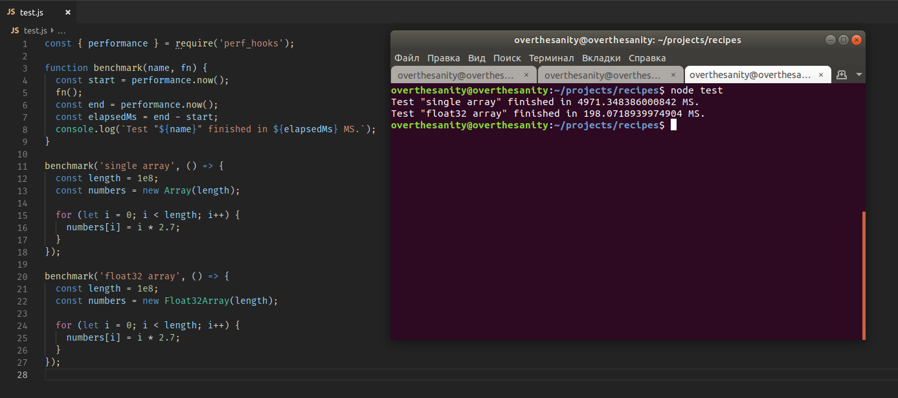

# Memory Management

## Preallocation

If you know in advance the length of the array being created, always specify it:

```typescript
// BAD
function getOnlySalaries(users: User[]): number[] {
  const salaries: number[] = [];

  for (let i = 0; i < users.length; i++) {
    const user = users[i];
    salaries.push(user.salary);
  }

  return salaries;
}

// GOOD
function getOnlySalaries(users: User[]): number[] {
  const length = users.length;
  const salaries = new Array<number>(length);

  for (let i = 0; i < length; i++) {
    const user = users[i];
    salaries[i] = user.salary;
  }

  return salaries;
}
```

## Typed Arrays

Don't use single `Array` when you work with numbers. Typed arrays have long been standard and are supported in all browsers. Choose any for your needs:

* `Int8Array`
* `Uint8Array`
* `Uint8ClampedArray`
* `Int16Array`
* `Uint16Array`
* `Int32Array`
* `Uint32Array`
* `Float32Array`
* `Float64Array`

Look how they're fast:



Typed arrays are `Iterable`, they can be passed as an input parameter to the `ngFor` for example.
