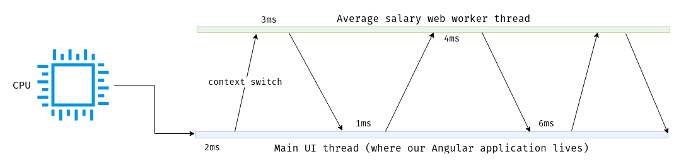

# Multithreading

## Web Workers

In simple terms web worker is a script that is executed in another thread.

What is multithreading? Multithreading is security. Thread is an isolated address space in which machine instructions are executed.

Multithreading allows the operating system to not get hung up on just one thread; in the context of the browser, it is the UI thread (the only one). The operating system switches between threads, providing each from 10 to 100 milliseconds of quantum time, thereby not blocking the main thread. At the same time, at each moment of time the processor is busy with only one task.

What problem are we gonna solve using web workers? Isolating heavy CPU-bound operations to the secondary thread, thereby enabling the user to continue to further interact with the UI.

Let's look at the below example, imagine a simple component that shows average salary of all workers:

```typescript
import { Component, ChangeDetectionStrategy } from '@angular/core';
import { ActivatedRoute } from '@angular/router';
 
@Component({
  selector: 'app-average-salary',
  templateUrl: './average-salary.component.html',
  changeDetection: ChangeDetectionStrategy.OnPush
})
export class AverageSalaryComponent {
  salary = this.route.snapshot.data.salary;
 
  constructor(private route: ActivatedRoute) {}
}
```

The salary is provided via `AverageSalaryResolver`:

```typescript
import { Injectable } from '@angular/core';
import { Resolve } from '@angular/router';

@Injectable({ providedIn: 'root' })
export class AverageSalaryResolver implements Resolve<number> {
  resolve(): number {
    const salaries = Array.from({ length: 1e7 }).map((_, index) => {
      return index * Math.random();
    });

    return (
      salaries.reduce((accumulator, value) => (accumulator += value), 0) / salaries.length
    );
  }
}
```

This is just a rough example for demonstrating purposes!

So when the user clicks the "average salary" link - Angular's router invokes resolve function and will wait 3-4 seconds until it returns any value. Also those mathematical operations are performed in the main thread and our UI is blocked. Can we deal with that? Definitely no.

Let's look how would we solve this problem using web worker. Let's create a file called `average-salary.worker.ts`:

```typescript
const worker = (this as unknown) as Worker;
 
const salaries = Array.from({ length: 1e7 }).map((_, index) => {
  return index * Math.random();
});
 
const average = salaries.reduce((accumulator, value) => accumulator += value, 0) / salaries.length;
 
worker.postMessage(average);
```

Nothing complicated right, the only thing is that the compiler thinks that `this` is `typeof globalThis`, but we're 100% sure that this script will be executed in the worker's scope, casting to `Worker` is type safe.

To use web workers in Angular - we have to use inline loader. As you know webpack allows to specify loaders in an `import` statement, like:

```typescript
import Styles from 'style-loader!css-loader?modules!./styles.css';
```

Also we've got an Angular + TypeScript combination, thus we have to help Angular understand how to resolve path to the web worker file. We have to create a `typings.d.ts` file in the src folder nearby your `index.html` and `main.ts`, and paste this code:

```typescript
declare module 'file-loader?name=[name].js!*' {
  const value: string;
  export = value;
}
```

Now we also can re-write our resolver code as follows:

```typescript
import { Injectable, NgZone } from '@angular/core';
import { Resolve } from '@angular/router';

import { Observable } from 'rxjs';

import * as averageSalaryWorkerUrl from 'file-loader?name=[name].js!./average-salary.worker';

@Injectable({ providedIn: 'root' })
export class AverageSalaryResolver implements Resolve<number> {
  constructor(private zone: NgZone) {}

  resolve(): Observable<number> {
    const worker = new Worker(averageSalaryWorkerUrl);
    return this.zone.runOutsideAngular(() => this.getAverageSalary(worker));
  }

  private getAverageSalary(worker: Worker) {
    return new Observable<number>(observer => {
      const listener = ({ data }: MessageEvent) => {
        observer.next(data);
        observer.complete();
      };

      worker.addEventListener('message', listener);

      return () => {
        worker.terminate();
        worker.removeEventListener('message', listener);
      };
    });
  }
}
```

The biggest plus of this approach is that our interface is not blocked, the user may not want to wait until another thread calculates the average salary. The user may want to go to another page, and since our main thread is not blocked, the router will unsubscribe from the `resolve` method, a callback will be invoked with `worker.terminate()`. No memory leaks, no UI blocking.



## Web Workers in Angular 8+

Startining from Angular 8 - web workers are a part of `@schematics/cli`. This means that you can generate a web worker via command line:

```console
ng generate webWorker average-salary
```

Schematics will generate 2 files - `average-salary.worker.ts` and `tsconfig.worker.json`:

```typescript
// average-salary.worker.ts

/// <reference lib="webworker" />

addEventListener('message', ({ data }) => {
  const response = `worker response to ${data}`;
  postMessage(response);
});
```

```json
// tsconfig.worker.json
{
  "extends": "./tsconfig.json",
  "compilerOptions": {
    "outDir": "./out-tsc/worker",
    "lib": [
      "es2018",
      "webworker"
    ],
    "types": []
  },
  "include": [
    "src/**/*.worker.ts"
  ]
}
```

Since now our resolver's code could be as follows:

```typescript
@Injectable({ providedIn: 'root' })
export class AverageSalaryResolver implements Resolve<number> {
  constructor(private zone: NgZone) {}

  resolve(): Observable<number> {
    const worker = new Worker('./average-salary.worker', { type: 'module' });
    return this.zone.runOutsideAngular(() => this.getAverageSalary(worker));
  }

  private getAverageSalary(worker: Worker) {
    return new Observable<number>(observer => {
      const listener = ({ data }: MessageEvent) => {
        observer.next(data);
        observer.complete();
      };

      worker.addEventListener('message', listener);

      return () => {
        worker.terminate();
        worker.removeEventListener('message', listener);
      };
    });
  }
}
```

NO INLINE IMPORTS needed!
